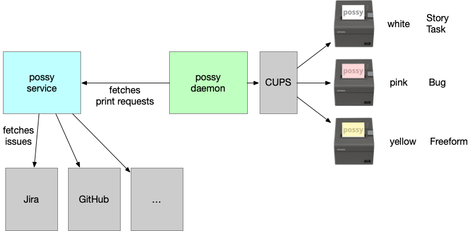
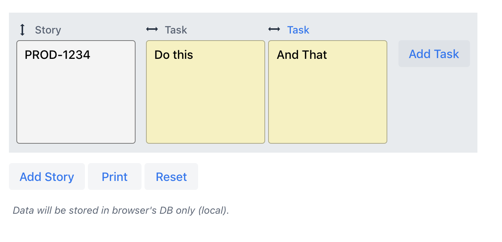

# possy   

Possy was created based on [Boris's](https://github.com/boris779) idea to print out tasks, bugs and other issues on POS Printer (e.g. Epson TM-T20II) instead of using Post-it®. This can be used as an addition for ***physical scrum and kanban boards***.

## Overview

## Components

Possy is split into 2 parts:
- possy-daemon
- possy-service

## Issuetypes

Possy knows 4 different types of issues:
- Stories
- Tasks
- Bugs
- Freeform (like a note)

## Printers

The issuetypes are mapped to 3 different printer which might use different colors:
- Stories -> white
- Tasks -> white
- Bugs -> pink
- Freeform -> yellow

## Planner

The Planner helps to batch print Freeform issues - Usecase: physical scrum and kanban boards

# Possy-Components

## possy-daemon 

The daemon part connects to a possy-service and fetches print requests (simply text or image content). For each print request a PDF will be generated and printed via [CUPS](https://www.cups.org) to one or more connected POS Printer(s). The daemon job might run on a [Pi](https://www.raspberrypi.org).

### Configuration

1. Edit or create profile, see `application.yml` in `daemon/src/main/resources`
1. Build app with Maven `mvn clean verify`
1. Run application using `mvn spring-boot:run` or directly running Application class from your IDE
1. Open `http://localhost:8081/` in browser

## possy-service 

The service is a Vaadin frontend, which creates print requests either by retrieving content from Jira or get manually entered issues.

### Configuration

1. Edit or create profile, see `application.yml` in `daemon/src/main/resources`
1. Build app with Maven `mvn clean verify`
1. Run application using `mvn spring-boot:run` or directly running Application class from your IDE
1. Open `http://localhost:8080/` in browser
1. Login with username `possy` and password `possy`
1. If you want to run your app production mode, run `mvn spring-boot:run -Pprod`

## Contributing
You want to contribute? Great! Thanks for being awesome!
Please see the project related [issues](https://github.com/gerald24/possy/issues)
before you start coding. Pull requests are always welcome!

### Code & Style
In short, we provide an `.editorconfig` file.
For more information please have a look at https://editorconfig.org/.
