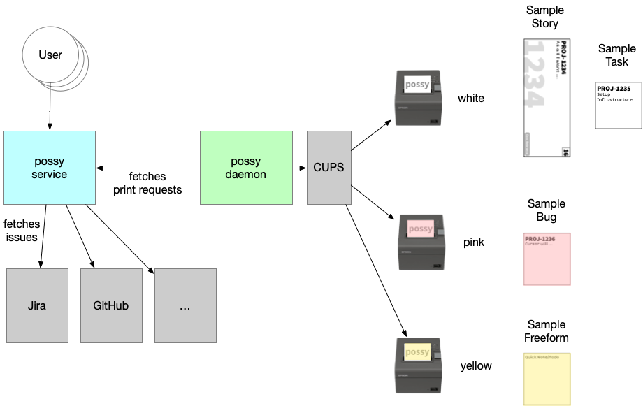

# possy
[](https://github.com/gerald24/possy/releases)
[](https://travis-ci.org/gerald24/possy)
[](https://sonarcloud.io/dashboard?id=net.g24.possy%3Areactor)
[](https://sonarcloud.io/dashboard?id=net.g24.possy%3Areactor)
[](https://possy-service.herokuapp.com/)
[](https://possy-daemon.herokuapp.com/)

Possy was created based on [Boris's](https://github.com/boris779) idea
to print out tasks, bugs and other issues on POS printers (e.g. Epson TM-T20II)
instead of using Post-it®, or print it on regular paper using the scissor.

Possy is intended to be used as addition for ***physical Scrum and Kanban boards***.
Read this [blog post](https://www.agsolutions.at/stories/printing-issues-with-possy) for further information.

## Overview



## Components

- possy-daemon
   - creates printable media out of print requests and talks to connected printers
- possy-service
   - user interface to create print requests, contains [Planner](docs/PLANNER.md)
- [CUPS](https://www.cups.org) (print platform)
   - see [Installation & Configuration Guide](docs/INSTALLATION.md) for setup
- Providers like [Jira](https://www.atlassian.com/software/jira), GitHub, etc.
   - currently only [Jira](https://www.atlassian.com/software/jira) supported

### possy-daemon

The daemon part connects to a possy-service and fetches print requests (simply text or image content).
For each print request a PDF will be generated and printed via CUPS to specific POS printers.

The daemon might run in a different network than possy-service. The deamon needs to reach possy-service over network, but
not vice versa.

The daemon job might run on a [Pi](https://www.raspberrypi.org).

### possy-service

The service is a [Vaadin](https://vaadin.com/) frontend, which creates print requests either by retrieving
content from different providers (e.g. Jira) or manually entered issues by users.

## Issue types

Possy knows 4 different types of issues:
- Stories
- Tasks
- Bugs
- Freeform (like a note)

## Printers

An issue type is mapped to a specific printer (currently up to 3 different printers possible):
- Stories -> white
- Tasks -> white
- Bugs -> pink
- Freeform -> yellow

## Demo

We provide a demo installation hosted on [Heroku](https://heroku.com/)
without real physical connected printers to test the user interface of possy-service.
Please note the application might need some time to load initially,
because apps on Heroku's free tier are going to sleep after some time of inactivity. 

- [possy-service](https://possy-service.herokuapp.com/)
   - username: `possy-heroku`
   - password: `possy-heroku`
   - currently no providers are connected, will be possible when [Issue 35](https://github.com/gerald24/possy/issues/35) is done
   - currently no preview of print requests is possible in the UI, see [Issue 31](https://github.com/gerald24/possy/issues/31)
- [possy-daemon](https://possy-daemon.herokuapp.com/)
   - just shows a very basic webpage with version information

## Getting Started

- [Installation & Configuration Guide](docs/INSTALLATION.md)
- [possy-service REST API docs](http://possy-service.herokuapp.com/swagger-ui.html)

## Contributing

You want to contribute? Great! Thanks for being awesome!
Please see the project related [issues](https://github.com/gerald24/possy/issues)
before you start coding. Pull requests are always welcome!

### Code & Style

In short, we provide an `.editorconfig` file.
For more information please have a look at https://editorconfig.org/.

### Building from source

1. Build with Maven `./mvnw clean verify`
1. Run application using `./mvnw spring-boot:run` or directly running Application class from your IDE
1. To build with production profile execute `./mvnw clean verify -Pprod -DskipTests`

## How to create a release

1. Clone the repository with git
1. Execute `./mvnw release:prepare release:clean` \
   Example prompt:
   ```
   [INFO] Checking dependencies and plugins for snapshots ...
   What is the release version for "possy"? (net.g24.possy:reactor) 1.0.2: : 1.0.2
   What is SCM release tag or label for "possy"? (net.g24.possy:reactor) v1.0.2-SNAPSHOT: : v1.0.2
   What is the new development version for "possy"? (net.g24.possy:reactor) 1.0.3-SNAPSHOT: : 1.0.3-SNAPSHOT
   ```
   Preparing a release goes through the following release phases:
   1. Check that there are no uncommitted changes in the sources
   1. Check that there are no SNAPSHOT dependencies
   1. Change the version in the POMs from x-SNAPSHOT to a new version (you will be prompted for the versions to use)
   1. Transform the SCM information in the POM to include the final destination of the tag
   1. Run the project tests against the modified POMs to confirm everything is in working order
   1. Commit the modified POMs
   1. Tag the code in the SCM with a version name (this will be prompted for)
   1. Bump the version in the POMs to a new value y-SNAPSHOT (these values will also be prompted for)
   1. Commit the modified POMs
1. If everything was successful in step 2 a Docker image with the provided
   version tag (e.g. v1.0.0) will get built automatically by CI/CD now
1. Optional: Go to GitHub releases page and provide a changelog
