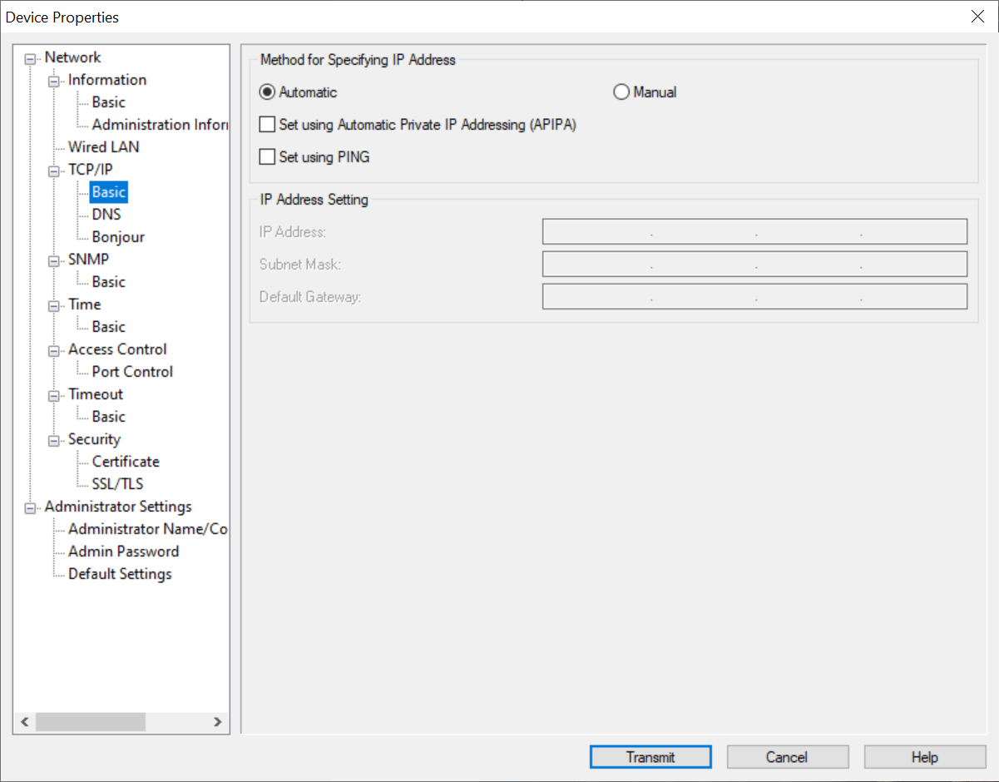
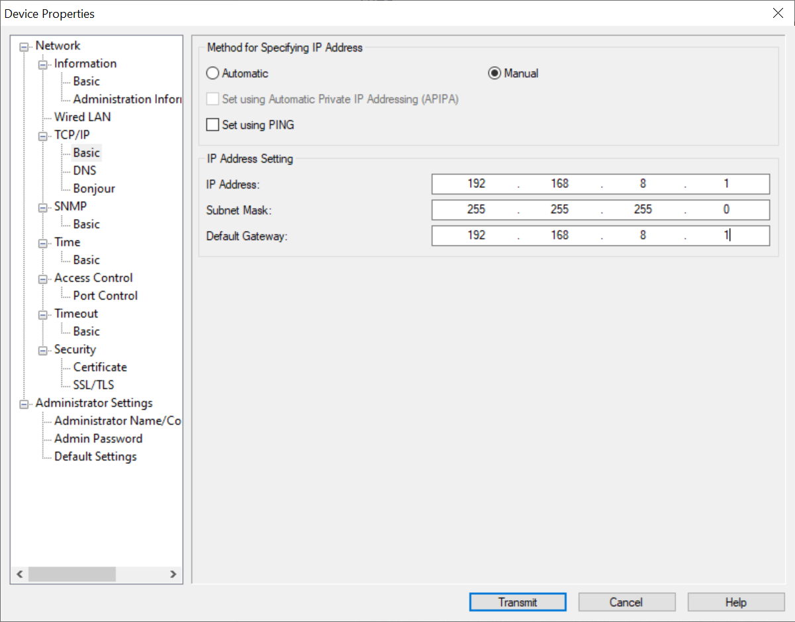
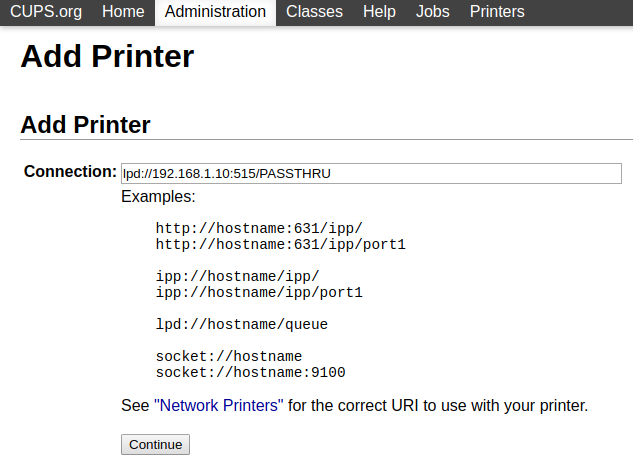
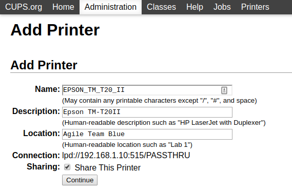
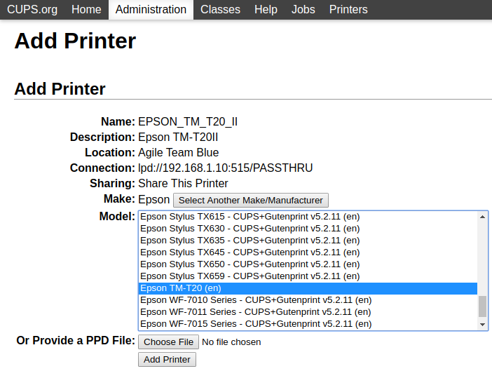
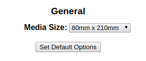
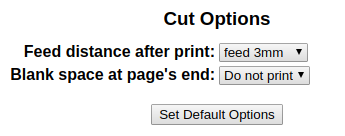

# Installation & Configuration Guide for possy

## POS printer setup

There are different ways to integrate your POS printer in your network,
depending on which model you are using. All descripted installations are
based on [Epson TM-T20II](https://epson.com/For-Work/Printers/POS/TM-T20II-POS-Receipt-Printer/p/C31CD52062)
with wired network connection.

Connect the printer to your network and use [EpsonNet Config](https://download.epson-biz.com/modules/pos/index.php?page=single_soft&cid=6047&scat=43&pcat=3)
for Windows or Mac OS to setup the IP address of your printer. In general it's recommended
to use a fixed/static IP address either by configure it on your DHCP server or by
specifying a fixed IP in Epson NetConfig. For details please see TM-T20II's official setup guide.


*Let your DHCP server or router manage the IP address of the printer. The MAC address of the printer should be pinned to a fixed IP.*


*Here an example of a static network config is used to integrate the printer in your network.*

Now the printer should be discoverable via network. To verify you can try to install
the printer on your workstation and print some kind of test page or POS commands directly.

## CUPS server & printer driver setup

We provide two installation options for Docker and Respberry Pi in this guide.
Of course you can install CUPS on any server, workstation, NAS or wherever you want.
Using e.g. Ubuntu (tested with 19.04) you can use the official [CUPS driver from Epson](https://www.epson-biz.com/modules/pos/index.php?page=single_soft&cid=3731).
For CUPS on Windows you can use e.g. the Docker setup.

Special thanks to [nemik](https://github.com/nemik) for providing a great open source
driver for TM-T20II we use for possy: https://github.com/nemik/epson-tm-t20-cups

### Docker

This is the easiest way to get CUPS and the driver for TM-T20II up and running as we provide
a preconfigured Docker image. The image is based on https://github.com/didrip/cups-docker.

```
docker run -d \
  -p 631:631/tcp \
  -e CUPS_USER_ADMIN=admin \
  -e CUPS_USER_PASSWORD=admin \
  --name cups-tm-t20 \
  --restart always \
  ajgassner/epson-tm-t20-cups:latest
```

Now you have a fully configured CUPS server including TM-T20II drivers running with restricted admin area access.
The Docker container needs to reach the printer over network.

### Raspberry Pi

Using [NOOBS](https://www.raspberrypi.org/downloads/noobs/) is recommended to setup your Pi.
Install and secure your Pi according to the official installation guides and connect it to the same
network as the POS printer is connected to. Then execute following commands:

```
sudo apt-get update
sudo apt-get install cups git libcups2-dev libcupsimage2-dev
cd ~
git clone https://github.com/nemik/epson-tm-t20-cups.git
cd epson-tm-t20-cups
make
cp rastertozj /usr/lib/cups/filter/
mkdir -p /usr/share/cups/model/Epson
cp tm20.ppd /usr/share/cups/model/Epson/
```

Alternatively you can watch https://www.youtube.com/watch?v=fGOcgz6z81I to setup the Pi.

## Add one (or more) POS printers to CUPS

1. Open `http://ip-host-of-cups-server:631` in a web browser
   1. Go to *Administration* and click on *Add Printer*
1. Select the TM-T20II and click on *Continue*
   1. If the printer is not listed (e.g. when using CUPS in Docker) select *LPD/LPR Host or Printer*
1. If prompted enter the printer's connection string, e.g. `lpd://192.168.1.10:515/PASSTHRU`\
   
1. Enter the printer's details. Enable printer sharing. **The name is used to identify the printer in possy!**\
   
1. Choose `Epson TM-T20 (en)` and click *Add Printer*\
   
1. Choose media size `80mm x 210mm`\
   
1. Go to *Cut Options* and select `feed 3mm` and click on *Set Default Options*\
   

The Epson TM-T20II is now connected to CUPS.

## Setup and configure possy services

standalone jar, see raspberry
docker preferred, easiest
service does not need to reach daemon


### possy-daemon

#### Docker

#### Systemd service on Raspberry Pi

Requires JDK >= 11 to be installed on your machine.

### possy-service

#### Docker


## possy-daemon

1. Edit or create profile, see `application.yml` in `daemon/src/main/resources`
1. Build app with Maven `./mvnw clean verify`
1. Run application using `./mvnw spring-boot:run` or directly running Application class from your IDE
1. Open `http://localhost:8081/` in browser

## possy-service

1. Edit or create profile, see `application.yml` in `daemon/src/main/resources`
1. Build app with Maven `./mvnw clean verify`
1. Run application using `./mvnw spring-boot:run` or directly running Application class from your IDE
1. Open `http://localhost:8080/` in browser
1. Login with username `possy` and password `possy`
